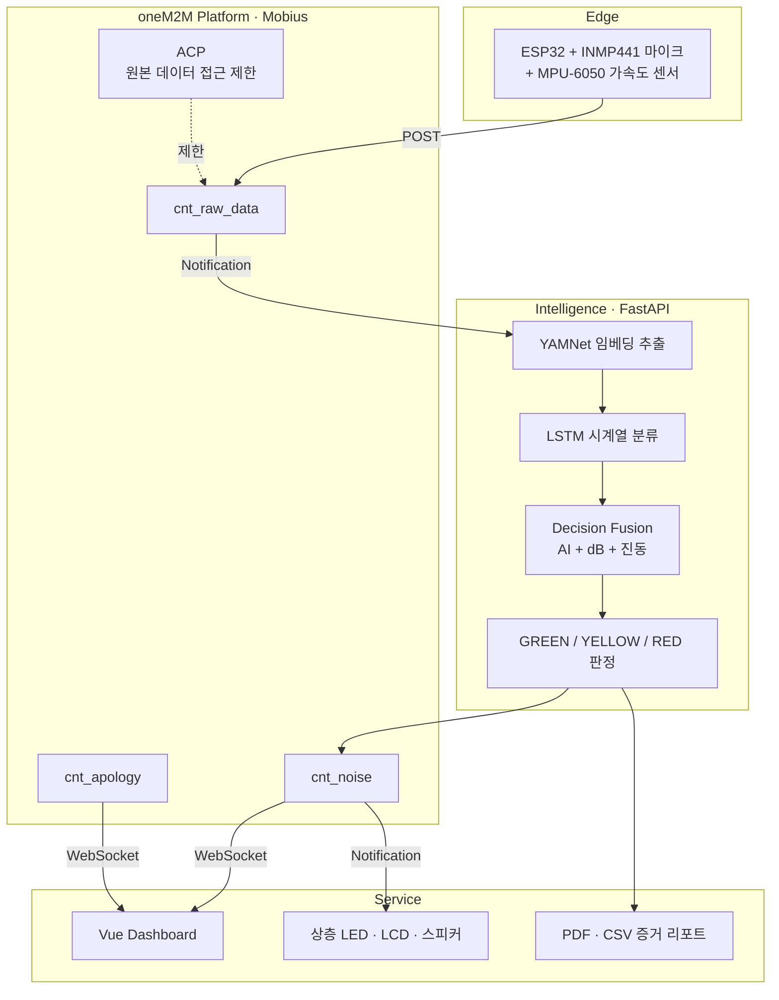

# D-Log — oneM2M 표준 및 AI 기반 층간소음 객관화 시스템

> IoT 센서와 AI 소음 분류를 결합해 층간소음을 **객관적 데이터로 기록**하고, 법적 기준 기반 증거 리포트와 비대면 중재를 제공하는 실시간 관리 플랫폼

[]()
[]()
[]()
[]()

| | |
|---|---|
| **기간** | 2026.01.25 ~ 2026.02.02 |
| **팀 구성** | Arduino 1 · Mobius/oneM2M 1 · **AI & Backend 1** |
| **기술 스택** | Python · FastAPI · YAMNet · LSTM · TensorFlow · Librosa · NumPy · Pandas · ESP32 · INMP441 · MPU-6050 · Mobius(oneM2M) · Vue.js · WebSocket |

<br/>

## 🔧 My Role — AI & Backend (@sophie-24)

- **담당 범위** — YAMNet 전이학습 + LSTM 소음 분류 모델, FastAPI 실시간 추론 서버, Decision Fusion 판정 로직, 법적 기준 소음 지표 계산, 증거 리포트 생성
- **핵심 성과**

| 지표 | 개선 전 | 개선 후 |
|---|---|---|
| 발망치 소음 분류 확신도 | 30% 미만 | **75% 이상** |
| 외부 소음 필터링 정확도 | — | **80% 이상** |
| 전처리 파이프라인 | 수동 | 약 **2,000개 샘플 자동 처리** |

<br/>

## 📌 프로젝트 소개

층간소음은 거주자 사이의 **주관적인 감정 대립**으로 시작되지만, 객관적인 발생 데이터가 부족해 갈등이 장기화되기 쉽습니다. 특히 간헐적으로 발생하는 소음은 전문 측정 인력이 현장에 도착했을 때 **재현되지 않아 입증이 어렵습니다.**

D-Log는 24시간 상시 모니터링으로 소음·진동 데이터를 수집하고, AI가 발망치·TV·대화·외부 소음을 분류해 층간소음 여부와 위험도를 판정합니다. 환경분쟁조정위원회 기준에 맞는 지표와 증거 리포트를 자동 생성하고, IoT LED 신호등과 사과 메시지로 **비대면 중재**를 지원합니다.

<br/>

## 🏗 Architecture

4계층(Edge – Platform – Intelligence – Service) 구조로 설계했습니다.



**설계 의도**

- **폴링 대신 oneM2M 구독·알림**을 사용해, 새 데이터가 저장되는 즉시 AI 서버가 분석을 시작합니다.
- 소음 분석과 사과 메시지 수신은 **독립적으로 동작**해, 분석 지연이 비대면 중재 메시지 전달을 막지 않습니다.
- **oneM2M ACP로 원본 소음 데이터 접근 권한을 AI 서버로 제한**해 세대 간 프라이버시를 보호합니다.

<br/>

## 🧭 기술적 의사결정

### 1. 범용 CNN 대신 YAMNet 전이학습 + LSTM 시계열 모델

**상황** — 발망치 소리는 단순한 한 시점의 음량보다 **반복성·지속성·천장 울림 패턴**이 핵심 특징입니다.

**판단** — 범용 모델의 단일 프레임 판단으로는 발망치와 문 닫는 소리를 구분하기 어려웠습니다. YAMNet은 **오디오 특징 추출기**로만 활용하고, 시간 순서 패턴 학습은 LSTM에 맡기도록 역할을 분리했습니다.

**결과** — 확신도 30% 미만 → 75% 이상. 아래 트러블슈팅 1번 참조.

### 2. AI 예측만 믿지 않고 진동 센서를 결합한 하이브리드 판정

**상황** — 큰 소리만으로는 실제 **층간 충격음**을 확정할 수 없습니다. 천둥이나 경적도 음량은 큽니다.

**판단** — AI가 발망치로 분류하더라도 **진동값이 낮으면** 실제 충격음이 아닐 수 있고, 반대로 AI 확신도가 다소 낮아도 진동이 임계치를 넘으면 위험으로 판단할 근거가 생깁니다. 모델 예측과 물리 센서 규칙을 결합했습니다.

**판정 규칙**

| 조건 | 판정 |
|---|---|
| 발망치 분류 + 신뢰도 ≥ 0.75 + 진동 임계치 초과 | **RED** |
| 외부 소음 분류 + 진동 낮음 | **알림 제외** |
| AI 신뢰도 75% + 5초 이상 지속 | **YELLOW / RED 등급 부여** |

### 3. 폴링 대신 oneM2M 구독·알림 기반 이벤트 드리븐

**상황** — 24시간 들어오는 센서 데이터를 주기적으로 조회하면 지연과 불필요한 요청이 발생합니다.

**판단** — Mobius 컨테이너 데이터 변경을 구독하고, 새 데이터 저장 즉시 Notification으로 AI 서버를 호출하도록 설계해 **구성 요소 간 결합도를 낮췄습니다.**

<br/>

## 🔍 트러블슈팅

<details>
<summary><b>1. 범용 YAMNet 모델의 층간소음 분류 확신도 30% 미만</b> — 30% → 75% 이상</summary>

<br/>

**문제**
사전학습된 YAMNet을 그대로 사용했을 때 **발망치 소리를 문 닫는 소리로 오인**하는 등 층간소음 특유의 울림·반복 충격을 구분하지 못해 확신도가 30% 미만으로 나타났습니다.

**원인 분석**
YAMNet의 사전학습 클래스는 일반 환경음 중심이라 **층간소음 도메인 특성**을 반영하지 못했고, 단일 프레임 분류로는 반복·지속 패턴을 포착할 수 없었습니다.

**해결**
- ESC-50 · UrbanSound8K에서 층간소음 관련 데이터를 선별해 **YAMNet 임베딩 기반 전이학습** 수행
- 오디오를 Mel-Spectrogram으로 변환하고 **1024차원 임베딩**을 특징 벡터로 사용
- 단일 프레임 대신 **LSTM 시퀀스 입력**으로 반복·지속 패턴 학습
- AI 결과에 dB·진동 센서 값을 결합하는 **Decision Fusion** 적용

**결과**
발망치 등 특정 소음의 AI 확신도를 **30% 미만 → 75% 이상**으로 개선하고, 물리 센서 검증을 추가해 오탐을 줄였습니다.

**배운 점**
사전학습 모델은 출발점일 뿐이며, **도메인 특성이 시간 축에 있다면 시계열 모델을 별도로 얹어야** 한다는 점을 배웠습니다.

</details>

<details>
<summary><b>2. Arduino 메모리 제약으로 AI 입력 샘플 부족</b> — 임베디드 트레이드오프</summary>

<br/>

**문제**
AI 추론에는 약 **1,000개 오디오 샘플**이 필요했지만, 센서 보드의 전송 버퍼와 메모리 제약으로 한 번에 **약 100개 샘플**만 전송할 수 있었습니다.

**해결**
부족한 샘플을 서버에서 **Zero-Padding**으로 채우고 입력 프레임을 정렬해 추론 파이프라인을 유지했습니다. 패딩이 모델 성능에 미치는 영향을 검증해 제한된 샘플에서도 핵심 패턴을 추출할 수 있음을 확인했습니다.

**배운 점**
임베디드 환경에서는 **모델 요구사항 · 메모리 · 전송 횟수 · 실시간성** 사이에서 트레이드오프를 설계해야 합니다. 모델을 먼저 정하고 하드웨어를 맞추는 순서는 위험합니다.

</details>

<details>
<summary><b>3. 외부 소음을 층간소음으로 오인하는 문제</b> — 필터링 정확도 80% 이상</summary>

<br/>

**문제**
천둥, 자동차 경적, 사이렌 같은 외부 소음이 큰 음량으로 감지되면 발망치·TV 소음으로 분류돼 **불필요한 경고**가 발생했습니다.

**해결**
**외부 소음 클래스를 별도로 추가**하고, 외부 소음으로 분류되면서 진동값이 낮은 경우에는 알림 대상에서 제외했습니다.

**결과**
외부 소음 필터링 정확도 **80% 이상**을 확보해 불필요한 알림을 줄였습니다.

**배운 점**
오탐을 줄이는 가장 효과적인 방법은 모델 성능 개선이 아니라 **"아닌 것"을 명시적으로 학습시키는 것**이었습니다.

</details>

<details>
<summary><b>4. 디지털 마이크와 Arduino 보드의 I2S 프로토콜 불일치</b> — 하드웨어 교체 판단</summary>

<br/>

**문제**
INMP441은 I2S 인터페이스를 사용하지만 초기 Arduino Uno 환경은 **I2S 주변장치를 지원하지 않아** 디지털 오디오 데이터를 안정적으로 수신할 수 없었습니다.

**해결**
외부 변환 모듈을 추가하는 대신, **I2S 하드웨어 컨트롤러와 듀얼 코어를 갖춘 ESP32로 메인 컨트롤러를 교체**했습니다. Serial Plotter로 실시간 오디오 파형이 끊김 없이 수신되는 것을 확인했습니다.

**배운 점**
센서 선택 시 **데이터 해상도뿐 아니라 보드의 인터페이스 지원 · 메모리 · 실시간 처리 성능**을 함께 검토해야 합니다. 변환 모듈로 우회하는 것보다 근본 원인을 제거하는 편이 이후 개발 속도를 지켰습니다.

</details>

<br/>

## ⚖️ 법적 기준 기반 증거 리포트

환경분쟁조정위원회 기준에 맞춰 다음 지표를 계산합니다.

| 지표 | 설명 |
|---|---|
| `Leq_1min` | 1분 등가소음도 |
| `Leq_5min` | 5분 등가소음도 |
| `Lmax` | 순간 고소음 발생 횟수 |

주간·야간 기준에 따라 임계값을 다르게 적용하고, **법적 기준 · 소음 레벨 가이드 · Top 5 발생 이벤트 · 소음 파형 · 기준 초과 여부**를 포함한 PDF·CSV 리포트를 자동 생성합니다.

<br/>

## 💡 회고 및 한계

IoT 센서 – oneM2M 플랫폼 – FastAPI AI 서버 – Vue 대시보드를 연결해, 소음 측정부터 AI 판정 · 비대면 경고 · 법적 증거 리포트 생성까지 End-to-End 파이프라인을 구현했습니다.

**남은 과제**

- 실제 아파트 환경 데이터 수집 (현재는 공개 데이터셋 기반)
- **Confusion Matrix · F1 Score 기반 모델 평가**와 교차 검증
- TensorFlow Lite 기반 엣지 추론으로 네트워크 지연 감소

> 현재 성능 수치는 공개 데이터셋과 제한된 테스트 환경 기준이며, **실제 주거 환경에서의 검증은 수행하지 못했습니다.** 일반적인 성능을 주장하려면 다양한 건물 구조·시간대에서의 반복 실험이 필요합니다.

<br/>

## 🚀 실행 방법

```bash
git clone https://github.com/sophie-24/Coss_IOT_2026.git
cd Coss_IOT_2026

pip install -r requirements.txt

# Mobius(oneM2M) 플랫폼 기동 후
uvicorn ai_server.main:app --reload
```
